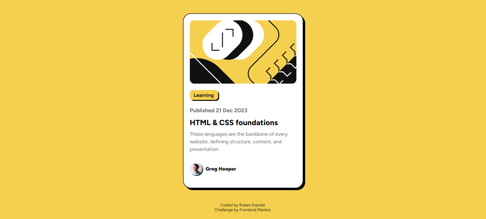
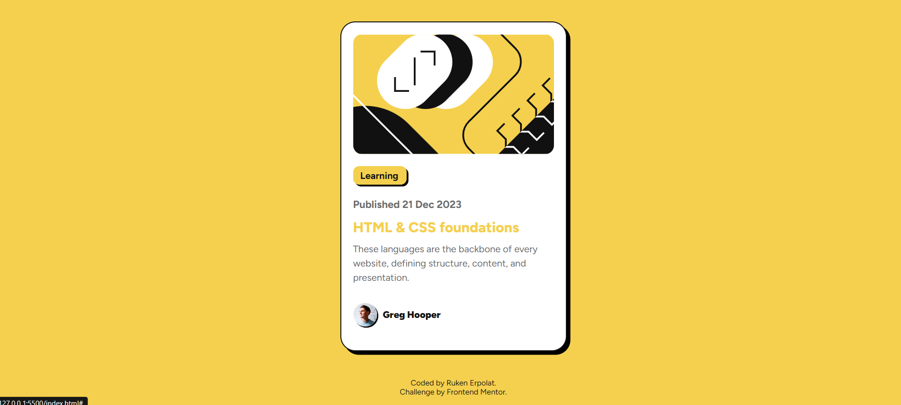

<h1 align="center">Frontend Mentor | Blog Preview Card</h1>

<div align="center">

🌐 [View Live Page](https://blog-preview-card-frontendmentorr.netlify.app/)  

</div>

A minimal and responsive blog preview card component built with **HTML** and **CSS**, inspired by a [Frontend Mentor](https://www.frontendmentor.io/challenges/blog-preview-card-ckPaj01IcS) challenge. The design focuses on clean typography, balanced spacing, and a subtle shadow effect to give a card-like appearance.



## Built With
✦ HTML5    
✦ CSS3 - Flexbox and responsive design      
✦ Google Fonts – [Figtree](https://fonts.google.com/specimen/Figtree)  

### Features
– Fully responsive design   
– Minimal and modern card UI  

#### Header active design: 
```html
<h2><a href="#">HTML & CSS foundations</a></h2>
```

```css
h2 {
    margin-bottom: 10px;
    font-weight: 800;
}

h2 a {
    color: var(--gray950);
    text-decoration: none;
}

h2 a:active {
    color: var(--yellow);
}
```



###  Project Structure
```
📂blog-preview-card
├── assets/
│   └── images/...
├── css/
│   └── style.css   
├── index.html      
├── .gitignore      
└── README.md       
```

###  Let’s connect:

[](https://linkedin.com/in/rukenerpolat)
[](https://medium.com/@rukenerpolat)
[](https://www.frontendmentor.io/profile/rukenerpolat)
[](https://github.com/rukenerpolat)

Thank you for your visit! 🖖     
<b><em>Ruken ERPOLAT</em></b>
